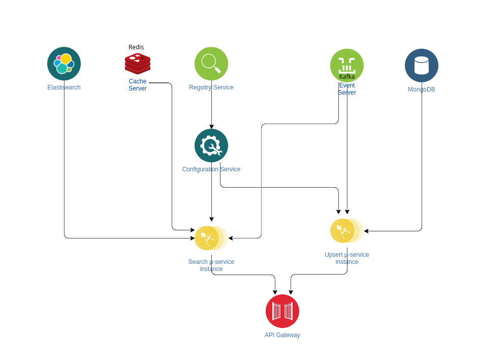
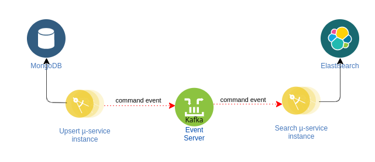

# CQRS Microservices

## Overview

- This is a proposed CQRS implementation using Spring Boot : 
  - Reading is done through **elastic search** ( + **redis** for caching )
  - Inserting/Updating is done through **Mongodb**
  - Configuration is available in a **configuration service**
  - Synchronizing updates (from mongodb  to elasticsearch) is done though a **kafka server**
  - An **Api gateway** (+ circuit breaker) is used to send requests to read/write
  - All these services are linked to a **Registry server**


## Architecture

### General Architecture


 ### General Flow



### Registry Service


- This service is the first service to be started, for this we used a **Eureka Server**
- All other services (clients) will be **registered** on this service to function properly. By binding their **address** to a specific **name**.
- If a service needs another service, it will request its name via the Registry service, which - if available - will give it back the desired instance, it also ensures the **load balancing** of the service instances

### Configuration Service


- This is the second service to start, only after the Registry Service.
- It **provides** the **configuration files** to the `Search` & `Upsert` µ-services.
- It uses a **github repository** to **pull** these files. Makings it even easier to change the configuration without starting the server over..

### Kafka Event Service



- Kafka Event service will distribute the commands events generated by the `upsert` µ-service to the `search` µ-service to update the elasticsearch database.
- This event forwarding guarantees the **synchronization** between the **Elasticsearch** database and **MongoDB**

### MongoDB

- MongoDB will be used for commands
- After each insert/update to mongodb. We will call the **projector** to update the ElasticSearch Server

### ElasticSearch Server

- Elasticsearch server will be used for queries
- It guarantees faster search queries than traditional databases
- On the other hand, commands maybe a little bit slow on this database. So ideally, they will be executed on schedules

### Redis Cache Server

- The redis cache server will cache specific **redundant** search queries, so that they will be returned quickly (without having to ask the elasticsearch database)

### APi Gateway


- The API Gateway will call the appropriate service based on the scenario: It will call the `upsert` µ-service on a command, and the `search` µ-service on a query ( mapped on `/queries` and `/commands` )
- If the failure ratio of the desired µ-service is high, the **circuit breaker** will detect that and call the **fallback method.**

## Usage

### Without using docker containers

If you want to run the services locally. Make sure that kafka, redis and elasticsearch are installed and listening on their default port.

After installing the necessary maven dependencies : 

- Change the host of the different services in `src/main/resources/application.properties` ( or `application.yml`) of each service. Or you can add them to your `iptable` as `localhost`
- Run the services in the following order:
  1. Run the Registry Service
  1. Run the Configuration Server
  1. Run the Upsert microservice
  1. Run the Search microservice
  1. Run the Api Gateway

### Using Docker containers

Make sure that `docker` &`docker-compose` are available on your machine. Then run :

```bash
docker compose up
```

Wait for the images to be pulled and the packaging to finish up. You can then access the **api gateway** on port `8082` (change it if necessary)
